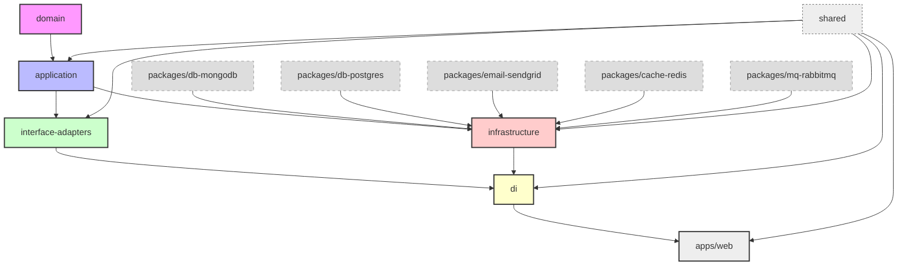

## 🌱 Future Project Structure (Scalable & Modular)

Once your project grows, the structure expands like this:

```bash
.
├── apps/
│   ├── web/                 # Web/API app
│   └── cli/                 # CLI commands (optional)
│
├── core/
│   ├── domain/
│   │   ├── entities/
│   │   ├── value-objects/
│   │   └── errors/
│   ├── application/
│   │   ├── use-cases/
│   │   │   ├── commands/
│   │   │   └── queries/
│   │   └── interfaces/
│   ├── interface-adapters/
│   │   ├── controllers/
│   │   ├── graphql/
│   │   ├── cli/
│   │   ├── webhooks/
│   │   ├── events/
│   │   ├── middlewares/
│   │   ├── presenters/
│   │   └── validators/
│   ├── infrastructure/
│   │   ├── gateways/
│   │   └── persistence/
│   └── di/
│       ├── container.ts
│       ├── ServiceRegistry.ts
│       └── resolve.ts
│
├── packages/
│   ├── db-mongodb/          # MongoDB implementation
│   ├── db-postgres/         # PostgreSQL implementation
│   ├── cache-redis/         # Redis cache adapter (for ICacheService)
│   ├── mq-rabbitmq/         # RabbitMQ adapter (for IMessageQueueService)
│   ├── email-sendgrid/      # SendGrid adapter
│   ├── shared/              # Cross-cutting shared utils
│   └── logger-pino/         # Pino logger service
│
├── tools/                  # Toolchain scripts and helpers
│   ├── db/                 # DB migration + seed tooling
│   ├── mono/               # CLI wrapper for build/test/lint/dev
│   └── template/           # Reusable project template package
│
└── design-system/           # (Optional) UI components
```

---

## 🔗 High-Level Dependency Diagram



---

## Using Turborepo on VS Code

This may type not update, use `CMD + Shift + P` and type "TypeScript: Restart TypeScrip Server" to update the type.
